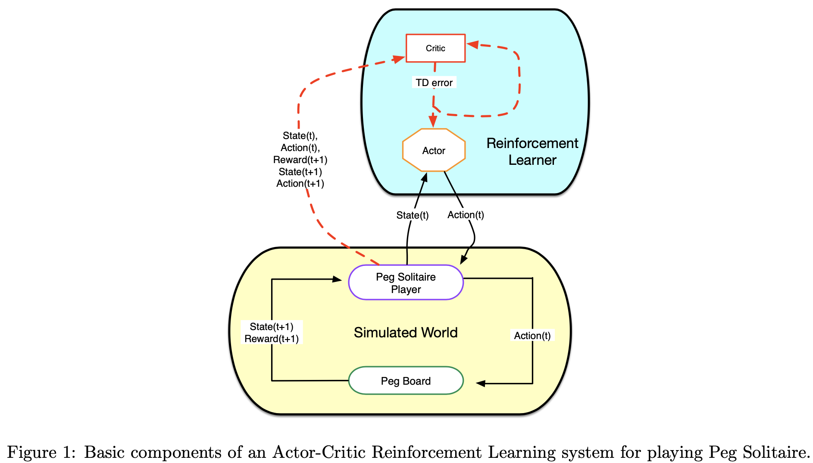
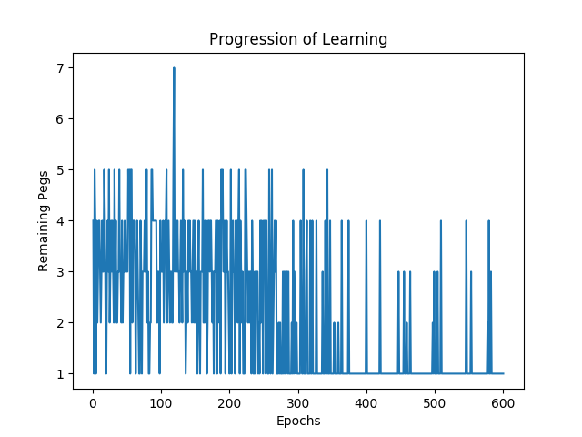
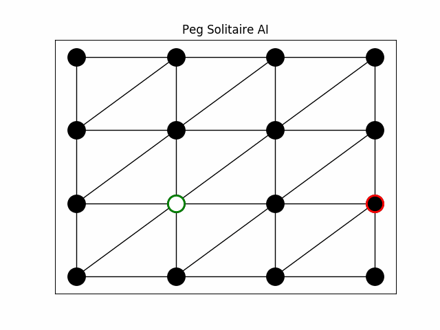

# Peg solitaire solver using Reinforcement Learning 🦾

In this project I build a general-purpose Actor-Critic Reinforcement Learner and apply it to assorted 
instances of a puzzle type known as Peg Solitaire, Hi-Q, or a variety of other names in other languages. 
For a complete description of the game, see [Wikipedia](https://en.wikipedia.org/wiki/Peg_solitaire).

Figure 1 provides a high-level view of the system design.
In relation to the classic breakdown of an RL system into agent and environment, the decomposition for 
this project consists of a) the RL system (i.e. agent) composed of an actor and critic, and b) the SimWorld, 
which incorporates the environment and all knowledge about states and their relationships in that environment. 
As shown in the diagram, it may also house a structure representing the actual player of the game, which is 
a very simple entity, given that the RL agent does most of the thinking in this project.

**File structure:**
* agent
    * actor.py
    * critic.py
    * reinforcement_learner.py
* environment
    * action.py
    * board.py
    * cell.py
    * peg_solitaire_player.py
    * sim_world.py
    * visualizer.py
    
The configs folder consists of different configs I have used for this project. In main.py it reads in these configs
and starts the whole training loop. Learning progression and an animation of the last run in the game is written
to the graph folder. 

Progression of Learning           |  Last game animated
:-------------------------:|:-------------------------:
  |  

